# MRO Vision Control: Real-Time Structural Defect Inspection Pipeline

[](https://www.python.org/)
[](https://fastapi.tiangolo.com/)
[](https://react.dev/)
[](https://onnxruntime.ai/)
[](https://www.docker.com/)
[](https://opensource.org/licenses/MIT)

An edge-deployable, full-stack computer vision system designed for autonomous concrete defect detection (cracks, rebar, spalling, and unexposed bars). The project processes raw high-frequency camera streams and inspection drone footage, overlays computer vision bounding boxes dynamically, compiles real-time telemetry datasets, and exposes interactive analytics via a responsive Web UI.

---

## Repository Structure

```
├── backend/
│   ├── app.py                     # FastAPI ASGI Server & Inference Engine
│   ├── database.py                # SQLite Database CRUD & Persistence Layer
│   ├── requirements.txt           # Python Dependency Declarations
│   ├── best.pt                    # Custom YOLOv8 Model Weights (PyTorch)
│   ├── best.onnx                  # Optimized YOLOv8 ONNX Weights (Auto-Generated)
│   ├── get_openh264.py            # Cisco OpenH264 Binary Downloader
│   ├── Dockerfile                 # Backend Containerization Specification
│   ├── static/                    # Processed Video Streams & HLS Segments
│   │   └── videos/
│   └── temp_uploads/              # Temporary Upload Directory (Ignored in Git)
├── frontend/
│   ├── src/
│   │   ├── App.jsx                # React App Dashboard with SVG Charts & Bounding Overlays
│   │   ├── App.css                # App CSS rules
│   │   ├── index.css              # Custom Vanilla HUD Styling System
│   │   └── main.jsx               # React entry point
│   ├── index.html                 # Entry HTML Document
│   ├── package.json               # Node Package configuration
│   ├── vite.config.js             # Vite compiler config
│   └── Dockerfile                 # Multi-stage Nginx Frontend Specification
├── docker-compose.yml             # Orchestration config for E2E deployment
├── migrate_videos.py              # Auxiliary utility for video codec migration
├── defect_detection_training.ipynb # Custom YOLOv8 Model Training Notebook
├── .gitignore                     # VCS exclusion patterns (Database, Node/Python libs, uploads)
└── README.md                      # Core Project Documentation
```

---

## Technical Architecture & Data Flow

```mermaid
graph TD
    %% Define Nodes for Webcam Pipeline
    subgraph Webcam ["1. Live Webcam Scan (Real-Time)"]
        Cam[Webcam Stream] -->|150ms Frame Blobs| API1[FastAPI Endpoint]
        API1 -->|ONNX Inference| YOLO1[YOLOv8 Model]
        YOLO1 -->|JSON Coordinates| Canvas[Canvas Overlay UI]
    end

    %% Define Nodes for Video Pipeline
    subgraph Video ["2. Drone Video Analysis (Async)"]
        Upload[Video File] -->|Upload Video| API2[FastAPI Background Task]
        API2 -->|Submit| Thread[ThreadPool Worker]
        Thread -->|Frame-by-Frame ONNX| YOLO2[YOLOv8 Model]
        
        %% Outputs
        YOLO2 -->|Save alert metadata| DB[(SQLite Database)]
        YOLO2 -->|Segment HLS| HLS[FFmpeg HLS Player]
        YOLO2 -->|Compile MP4| MP4[Final Video Download]
        
        %% Dashboard Visuals
        DB & HLS -->|Visualize & Stream| Dash[SVG Dashboard & seekable Player]
    end

    %% Node styling classes for high-contrast cyberpunk HUD look
    classDef client fill:#121824,stroke:#58a6ff,stroke-width:2px,color:#fff;
    classDef server fill:#161e2e,stroke:#38d056,stroke-width:2px,color:#fff;
    classDef model fill:#161e2e,stroke:#ff5f40,stroke-width:2px,color:#fff;
    classDef db fill:#0a0e14,stroke:#f0883e,stroke-width:2px,color:#fff;

    class Cam,Canvas,Upload,Dash client;
    class API1,API2,Thread,HLS,MP4 server;
    class YOLO1,YOLO2 model;
    class DB db;
```



### Data Pipeline Mechanics
1. **Accelerated Inference & Bounding Overlays**: The client grabs video frames via `getUserMedia` at an interval of `150ms`, rendering them to an offscreen HTML5 `canvas` element. The raw pixel arrays are converted into a JPEG blob and POSTed to `/api/process-frame`. The backend decodes the bytes and performs inference using the optimized **YOLOv8 ONNX** model. The React client draws bounding boxes and class labels on a transparent canvas overlay, saving CPU cycles and network bandwidth.
2. **Webcam Scan Congestion Guard**: The frontend protects the API against network frame backup under heavy load. A custom ingestion lock skips frame submission ticks if a previous inference request is still in-flight.
3. **Concurrency & Telemetry Persistence**: Under upload concurrency, Python-level video compiling is offloaded to a global thread pool using `ThreadPoolExecutor` to bypass event loop blocking. Task logs, progress, and detected alerts are written into a persistent local **SQLite Database** (`data.db`) utilizing Write-Ahead Logging (WAL) and busy timeouts for concurrent write resilience.
4. **Dynamic HLS Slicing**: As drone footage processes, the backend pipes raw frames into an `ffmpeg` subprocess that compiles and slices them on-the-fly into HTTP Live Streaming (HLS) formats (`playlist.m3u8` and `.ts` segments). The user can stream the annotated video segments immediately via `hls.js` while the task runs in the background. On completion, the frontend switches to the finalized `.mp4` file for high-performance seeking and download availability.
5. **Interactive Anomaly Filtering & SVG Dashboard**: The sidebar features category options (filters for cracks, spalling, exposed bars) and confidence sliders to filter the logs list. Interactive SVG graphs (Bar Chart and Spatial Tunnel Density Line Chart) dynamically recalculate and redraw their shapes in real-time as filters are adjusted.
6. **On-Demand Telemetry CSV Export**: An in-memory report streaming generator packages all SQLite-logged anomalies for a task and compiles them on-demand into download-ready CSV reports without incurring local disk I/O overhead.
7. **System Dependency Validation Checks**: On backend startup, the engine performs system check scans (e.g. verifying `ffmpeg` installation in PATH) to immediately flag environmental configuration gaps.

---

## Machine Learning Defect Classes

The YOLOv8 model is trained to identify and track four target concrete defects:
- **Class 0 (`crack`)**: Structural cracks indicating tensile stress.
- **Class 1 (`rebar`)**: Exposed structural reinforcement bars.
- **Class 2 (`spalling`)**: Flaking or breaking off of concrete chunks.
- **Class 3 (`unexposed bar`)**: Subsurface structural elements showing signs of exposure.

---

## Local Installation & Setup

### Option A: Quickstart with Docker (Recommended)
This method orchestrates both services and compiles system libraries (FFmpeg, system codecs) automatically inside Docker containers.
1. Make sure Docker and Docker Compose are installed.
2. In the root workspace directory, run:
   ```bash
   docker-compose up --build
   ```
3. Open `http://localhost` in your browser. (The React client runs on port `80`, communicating dynamically via client-side requests with the FastAPI container on port `8000`).

### Option B: Manual Setup

#### 1. Backend Setup
1. Navigate to the `backend/` directory:
   ```bash
   cd backend
   ```
2. Install the Python dependencies:
   ```bash
   pip install -r requirements.txt
   ```
3. Compile the YOLO PyTorch model to ONNX:
   ```bash
   python -c "from ultralytics import YOLO; YOLO('best.pt').export(format='onnx', simplify=True)"
   ```
4. Download the OpenH264 binary (required by OpenCV for H.264 video compression on Windows):
   ```bash
   python get_openh264.py
   ```
5. Start the FastAPI application server:
   ```bash
   python app.py
   ```
   *The backend will run on http://localhost:8000.*

#### 2. Frontend Setup
1. Navigate to the `frontend/` directory:
   ```bash
   cd frontend
   ```
2. Install the npm packages:
   ```bash
   npm install
   ```
3. Start the Vite development server:
   ```bash
   npm run dev
   ```
   *The frontend client will run on http://localhost:5173.*

---

## Production & Architectural Notes

- **Dynamic API Targeting:** The web client automatically resolves the backend base URL dynamically (connecting to port `8000` on the hostname from which the client is accessed).
- **Production Reverse Proxy / HTTPS:** If deploying this pipeline with HTTPS support in production, you should update the Nginx configuration inside the frontend Docker image to act as a reverse proxy, mapping `/api/` traffic directly to the backend container over standard SSL. This prevents modern browsers from blocking mixed HTTP/HTTPS content.
- **Inference Concurrency & Lock:** To prevent model corruption and memory faults during concurrent drone video analyses and live webcam scans, YOLOv8 inference is protected by a global thread lock.
- **SQLite WAL & Timeout:** SQLite database queries use connection timeouts (`30.0s`) and Write-Ahead Logging (WAL) mode to resolve write-locking conflicts under concurrent task telemetry uploads.
- **Memory Optimization:** Large file video uploads are read and written to disk in `1MB` chunks, preventing edge-deployment memory bloat or out-of-memory container crashes.
- **Web-Playable Outputs:** Completed inspection videos are automatically re-encoded to standard H.264 (`yuv420p` color format) with fast-start metadata (`+faststart`) to guarantee immediate progressive playback and seeking inside all standard web browsers.
